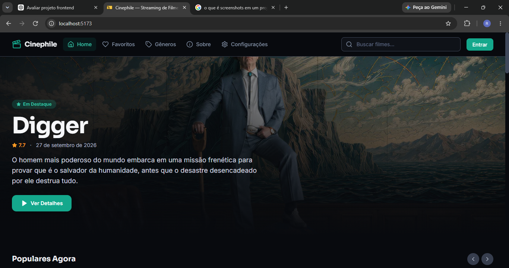
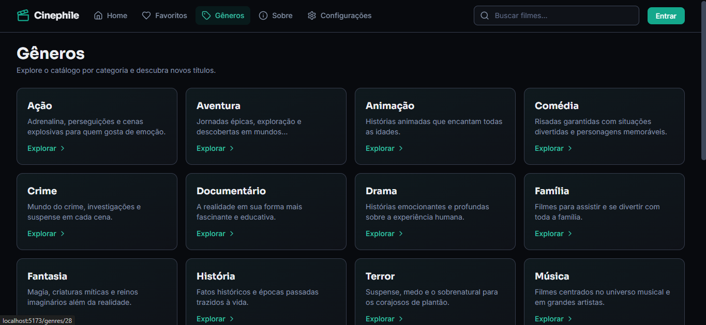
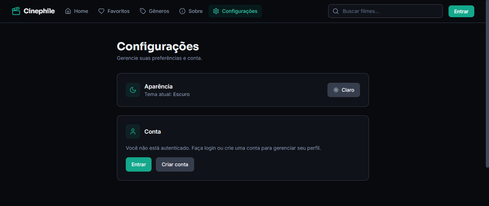
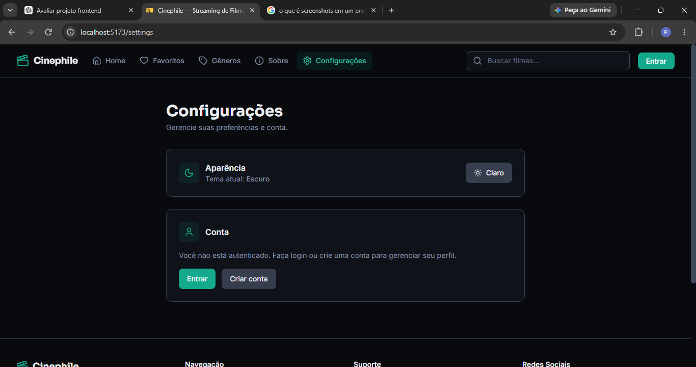
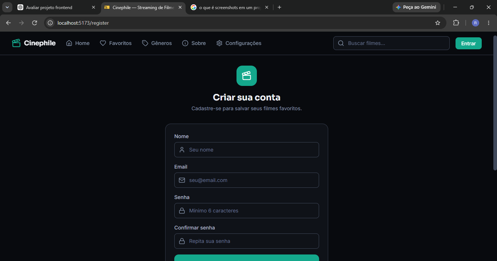

# Cinephile

Cinephile é uma aplicação frontend para exploração e descoberta de filmes, permitindo consultar informações detalhadas, navegar por gêneros, pesquisar títulos e salvar favoritos em uma interface moderna e responsiva.

## 🚀 Tecnologias

- React 18 e TypeScript
- Vite
- TanStack Router
- Tailwind CSS
- Supabase Auth e Edge Functions
- The Movie Database (TMDB)
- Lucide e Simple Icons

## ✨ Funcionalidades

- Catálogo de filmes populares, em cartaz, mais bem avaliados e em alta
- Busca, navegação por gêneros e páginas de detalhes com elenco e recomendações
- Lista de favoritos salva no navegador
- Cadastro, login e configurações de conta
- Tema claro e escuro

## 🏗️ Arquitetura

A interface é uma SPA React organizada em páginas, componentes reutilizáveis, hooks e serviços. O TanStack Router controla a navegação; os serviços consultam uma Supabase Edge Function que intermedeia as chamadas à API do TMDB. A autenticação usa Supabase Auth, e os favoritos são persistidos no armazenamento local do navegador.

## 📸 Capturas de tela

**Página inicial**

**Exploração por gêneros**

**Detalhes e recomendações de um filme**

**Configurações de aparência e conta**

**Cadastro de usuário**

## ⚙️ Como executar

Pré-requisitos:

Node.js
npm
Projeto configurado no Supabase
Chave da API do TMDB
Instalação

Clone o repositório e instale as dependências:

npm install
Variáveis de ambiente

Crie um arquivo .env na raiz do projeto:

VITE_SUPABASE_URL=
VITE_SUPABASE_ANON_KEY=

As variáveis devem conter as informações do projeto Supabase.

A chave da API do TMDB deve permanecer configurada no ambiente da Supabase Edge Function tmdb-proxy, não no frontend.